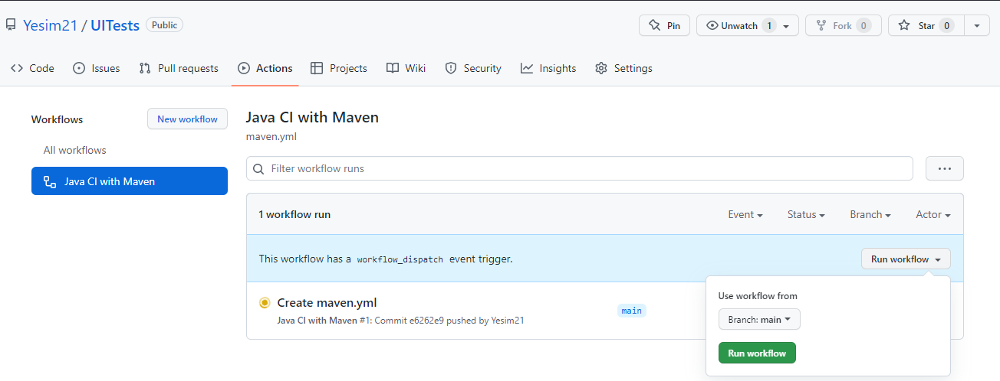
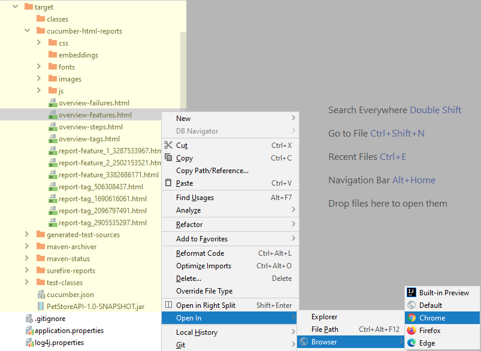
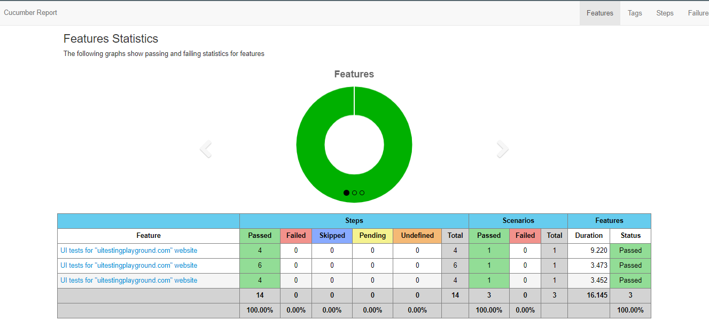

UI Tests

**Tech Stack**: Java, Selenium, JUnit, Maven, Cucumber, Log4j

**Website**: http://www.uitestingplayground.com/home

**How to run?**

- Open command prompt and go to application folder
- Write "**mvn clean verify**" and hit enter
- If you want to run specific feature, get the feature tag and set it into tags in Runner class

**How to run test in a CI/CD pipeline?**

- Go to GitHub Actions and select workflow and click "Run workflow"

 
**Report**

After running the application, it generates the report under the "target" folder
Go to the target folder and open overview-features.html in any browser

The report seems on the browser like: 
 

Calliope.pro link: https://app.calliope.pro/profiles/4322

Improvement: UI should be improved because it does not seem perfect.  

**Scenarios Approach**

- The most common scenarios are selected so that are useful for testing scope. My scenarios are just enough for now but will be increased with Mouse Over, Load Delay, Progress Bar etc.
